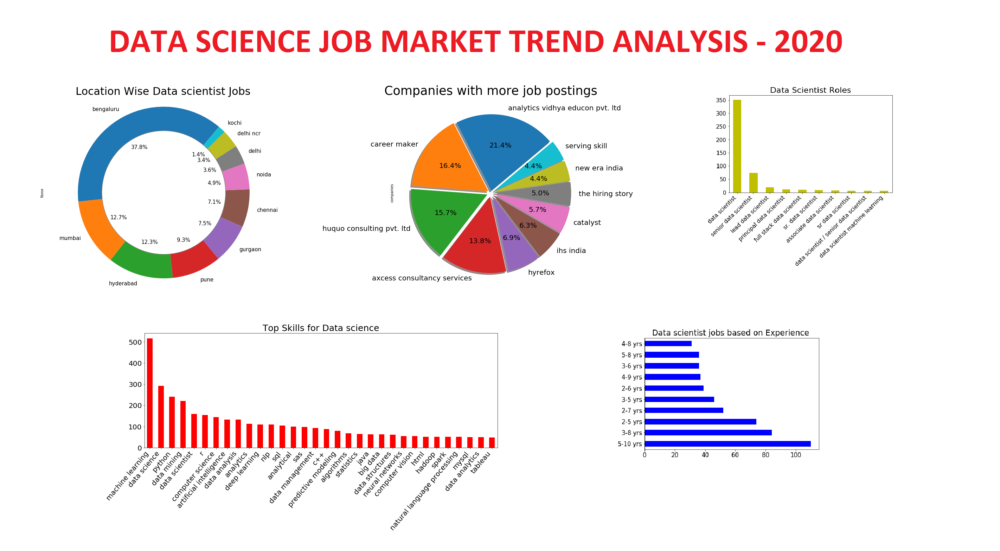

# Data-Science-Job-Market-Analysis - 2020

## About:
This analysis is done by Extracting 1000 recent Data scientist jobs from the job portal(naukri.com) using scraping.
Objective is to analyze the current job market trends for Data science.

## Dependencies:
* Python
* matplotlib
* pandas
* selenium

All dependencies can be installed using [pip](https://pip.pypa.io/en/stable/)

## Analysis Overview:
I wrote a [blog](https://medium.com/@shareefshaik1375/65ad68553cc4?source=friends_link&sk=10d8908753228ab78a0185adcde6bbaf) covering all the findings of this anslysis,I strongly recommend you to have a look at it to get more clear understanding.

